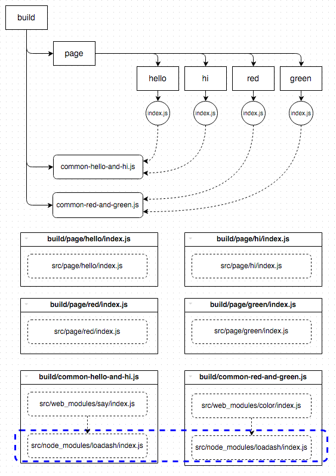

# common-bundle
[](https://www.npmjs.org/package/common-bundle)
[](https://travis-ci.org/reducejs/common-bundle)
[](https://coveralls.io/github/reducejs/common-bundle)
[](https://david-dm.org/reducejs/common-bundle)
[](https://david-dm.org/reducejs/common-bundle#info=devDependencies)


A [`browserify`] plugin for packing modules into common shared bundles.

**Features**:

* Group one or more entries (modules) together to create a bundle.
* Extract common modules from bundles to create additional shared bundles.
* `b.bundle()` generates a stream flowing [`vinyl`] file objects.

## Example

**input**:


### One bundle for each page

```javascript
var browserify = require('browserify')
var glob = require('glob')
 
var basedir = '/path/to/src'
var entries = glob.sync('page/**/index.js', { cwd: basedir })
var b = browserify(entries, { basedir: basedir })
 
b.plugin('common-bundle', {
  // Pack each index.js and their dependencies into a new bundle
  // e.g. '/path/to/src/page/hi/index.js' => 'page/hi/index.js'
  groups: 'page/**/index.js',
})
 
var vfs = require('vinyl-fs')
// Write all bundles to the build directory
// e.g. 'page/hi/index.js' => '/path/to/build/page/hi/index.js'
b.bundle().pipe(vfs.dest('/path/to/build'))

```

**output**:


### One additional bundle shared by all page-specific bundles

```javascript
var browserify = require('browserify')
var glob = require('glob')
 
var basedir = '/path/to/src'
var entries = glob.sync('page/**/index.js', { cwd: basedir })
var b = browserify(entries, { basedir: basedir })
 
b.plugin('common-bundle', {
  // Pack each index.js and their dependencies into a new bundle
  // e.g. '/path/to/src/page/hi/index.js' => 'page/hi/index.js'
  groups: 'page/**/index.js',

  common: {
    // create a common bundle for bundles
    // whose path matches 'page/**/index.js'
    // e.g. 'page/hi/index.js', 'page/hello/index.js',
    // 'page/red/index.js', 'page/green/index.js'
    output: 'common.js',
    filter: 'page/**/index.js',
  },
})
 
var vfs = require('vinyl-fs')
b.bundle().pipe(vfs.dest('/path/to/build'))

```

**output**:


#### [`factor-bundle`]
The default output of [`factor-bundle`] would be:


**NOTE**:
[`factor-bundle`] may pack modules, that are not needed by some pages, into the common bundle. `common-bundle` will try to make sure every page load only necessary modules.

### Shared bundle for each group of page-specific bundles

```javascript
var browserify = require('browserify')
var glob = require('glob')
 
var basedir = '/path/to/src'
var entries = glob.sync('page/**/index.js', { cwd: basedir })
var b = browserify(entries, { basedir: basedir })
 
b.plugin('common-bundle', {
  groups: 'page/**/index.js',

  common: [
    {
      output: 'common-hello-and-hi.js',
      filter: ['page/hello/index.js', 'page/hi/index.js']
    },
    {
      output: 'common-red-and-green.js',
      filter: ['page/red/index.js', 'page/green/index.js']
    },
  ],
})
 
var vfs = require('vinyl-fs')
b.bundle().pipe(vfs.dest('/path/to/build'))

```

**output**:



## options

* [groups](#groups)
* [common](#common)

### groups
Groups entries (with their dependencies) together
and create a new bundle for each group.

Types of possible values:
* `Object`. [`groups.output`](#groupsoutput), [`groups.filter`](#groupsfilter)
* `String`. Equivalent to `{ filter: groups }`.
* `Function`. Equivalent to `{ output: groups }`.
* `Array`. Elements are treated as a `groups` option and processed one by one.

#### groups.output
Specify paths to new bundles.

* `String`.
Should be a path relative to the final build directory.
```js
{
  // entries like 'page/**/index.js' will be packed into bundle.js
  output: 'bundle.js',
  filter: 'page/**/index.js',
}

```

* `Function`.
`groups.filter` will be ignored. Called with each module file path,
and the returned value (if any) is used as the file path to the new bundle.

```js
{
  output: function (file) {
    if (file.endsWith('/page/hi/index.js')) {
      return 'page/hi/index.js'
    }
    if (file.endsWith('/page/hello/index.js')) {
      return 'page/hello/index.js'
    }
  },
}

```

* otherwise.
If a new bundle should be created to contain the module matched by `groups.filter`,
`path.relative(basedir, moduleFile)` is used as the file path to the new bundle.

#### groups.filter
Specify the the entries that should go to the new bundle

* `String`, `Array`.
Passed to [`multimatch`] to test module files.
Relative patterns will be resolved to absolute paths from [basedir](#basedir).

* `Function`.
Called with each module file path.
If `true` returned, that module will be packed into a new bundle.

#### Sugar cases for the groups option
* `b.plugin('common-bundle', { groups: pattern })` is equivalent to 
`b.plugin('common-bundle', { groups: { filter: pattern } })`,
where `pattern` is `String` or `Array`.

* `b.plugin('common-bundle', { groups: fn })` is equivalent to 
`b.plugin('common-bundle', { groups: { output: fn } })`,
where `fn` is `Function`.

* `b.plugin('common-bundle', { groups: arr })`, where `arr` is `Array`.
Each element is processed as a `groups` option.

```javascript
[
  {
    output: 'page/A/index.js',
    filter: 'page/A/index.js',
  },
  {
    output: 'page/B/index.js',
    filter: 'page/B/index.js',
  },
]

```

### common
After processing `options.groups`, some *original* bundles have been created.

The original bundles (or some of them)
may share some common modules.
We can use `options.common` to create common bundles
containing those shared modules,
and remove them from the original bundles.

#### common.output
Specify the file path to the new common bundle.

Type: `String`

```js
// Modules shared by all original bundles go to `common.js`
b.plugin('common-bundle', {
  common: {
    // the file path to the new common bundle
    output: 'common.js',
    // the filter glob will be used to match original bundles
    filter: '**/*.js',
  },
})

```

#### common.filter
Specify which bundles to share the new common bundle.

* `String`, `Array`.
Passed to [`multimatch`] to test bundle files.

* `Function`.
Receives all the bundles created yet (including common bundles),
and should return some of them.

* *otherwise*.
The new common bundle is shared by all bundles created yet.

```js
b.plugin('common-bundle', { common: 'common.js' })

```

#### common.threshold
Specify which modules to go to the common bundle.

* `Number`.
Modules required by more than the specified amount of bundles go to the common bundle.
This is the default case, and the default value is the aount of all the sharing bundles.
* `Function`.
Signature: `threshold(file, numberOfRequiringBundles)`.
If `true` returned, `file` will go to the common bundle.

#### Sugar cases for the common option

* `b.plugin('common-bundle', { common: commonBundle })` is equivalent to
`b.plugin('common-bundle', { common: { output: commonBundle } })`,
where `commonBundle` is `String`.


#### Multiple common options
`b.plugin('common-bundle', { common: arr })`, where `arr` is `Array`.

Actually, the common option is used to set the dependency relationship between bundles.
If bundle `a.js` is declared to depend on `b.js`,
modules in `b.js` should not be included in `a.js`,
because 'depend' means that `b.js` should be loaded before `a.js`, so no need to load them again from `a.js`.
However, if `b.js` does not exist yet,
it should be created and contain the common modules shared by its dependents in the current configure.

Each element is treated as an `options.common` and processed one by one to create new bundles.

```js
{
  common: [
    // Declare that both a.js and b.js should depend on common.js
    // As common.js does not exist, it is created to contain modules shared
   // by both a.js and b.js
    {
      output: 'common.js',
      filter: ['a.js', 'b.js']
    },

    // Declare that a.js and c.js should depend on common.js
    // As common.js already exists, no extra bundle need to be created
    // But modules in c.js are removed if they are also in common.js
    // Since a.js has already been declared to depend on common.js in the previous
    // configure, nothing will happen to it here
    // In a word, this configure will NOT modify the contents of common.js
    // It only removes some modules from c.js
    {
      output: 'common.js',
      filter: ['a.js', 'c.js']
    },

    // declare that b.js and c.js should depend on common.js
    // they already does, so nothing happens
    {
      output: 'common.js',
      filter: ['b.js', 'c.js']
    }
  ]
}

```

### basedir
Specify the base for relative paths to bundles and module files.

Type: `String`

Default: `b._options.basedir`

## Events

### b.on('common.map', (bundleMap, inputMap) => {})

Suppose there are two pages, `hi` and `hello`,
and both depend upon `lodash` and `say`.

We can use the following options to create a `common.js`,
and check `bundleMap` and `inputMap`.

```js
b.plugin('common-bundle', {
  groups: 'page/**/index.js',
  common: 'common.js',
})
b.on('common.map', function (bundleMap, inputMap) {
  console.log(JSON.stringify(bundleMap, null, 2))
  console.log(JSON.stringify(inputMap, null, 2))
})

```

**bundleMap**

```js
{
  // bundle => {}
  "page/hi/index.js": {
    // modules in this bundle
    "modules": [
      "/Users/zoubin/usr/src/reducejs/common-bundle/example/map/src/page/hi/index.js"
    ],
    // bundles should come before this bundle
    "deps": [
      "common.js"
    ]
  },
  "page/hello/index.js": {
    "modules": [
      "/Users/zoubin/usr/src/reducejs/common-bundle/example/map/src/page/hello/index.js"
    ],
    "deps": [
      "common.js"
    ]
  },
  "common.js": {
    "modules": [
      "/Users/zoubin/usr/src/reducejs/common-bundle/example/map/src/node_modules/lodash/index.js",
      "/Users/zoubin/usr/src/reducejs/common-bundle/example/map/src/web_modules/say/index.js"
    ]
  }
}

```

**inputMap**

```js
{
  // input file => [bundles should be loaded to use `input`]
  "/Users/zoubin/usr/src/reducejs/common-bundle/example/map/src/page/hello/index.js": [
    "common.js",
    "page/hello/index.js"
  ],
  "/Users/zoubin/usr/src/reducejs/common-bundle/example/map/src/page/hi/index.js": [
    "common.js",
    "page/hi/index.js"
  ]
}

```

### b.on('common.pipeline', (id, pipeline) => {})

Every time a bundle created, a `common.pipeline` event is emitted with its `id` and the packing `pipeline`.

A `pipeline` is a [labeled-stream-splicer](https://npmjs.org/package/labeled-stream-splicer):

* `'pack'` - [browser-pack](https://npmjs.org/package/browser-pack)
* `'wrap'` - apply final wrapping

You can call `pipeline.get` with a label name to get a handle on a stream pipeline that you can `push()`, `unshift()`, or `splice()` to insert your own transform streams.

Event handlers must be attached *before* calling `b.plugin`.

## Work with [`watchify2`] and [`gulp`]

```javascript
var through = require('through2')
var browserify = require('browserify')

gulp.task('build', function() {
  var b = browserify({ basedir: '/path/to/src' })
  b.plugin('common-bundle', {
    // page-specific bundles
    groups: 'page/**/index.js',
    // common bundle shared by all pages
    common: 'common.js',
  })

  return gulp.src('page/**/index.js', {
    cwd: b._options.basedir,
    read: false,
  })
  .pipe(through.obj(function (file, _, next) {
    b.add(file.path)
    next()
  }, function (next) {
    b.bundle()
      .on('data', file => this.push(file))
      .on('end', () => this.push(null))
  }))
  .pipe(gulp.dest('build'))
})

gulp.task('watch', function (cb) {
  var b = browserify({ basedir: '/path/to/src' })
  b.plugin('common-bundle', {
    // page-specific bundles
    groups: 'page/**/index.js',
    // common bundle shared by all pages
    common: 'common.js',
  })

  b.plugin('watchify2', {
    // now we can add or remove page entries
    // and that would cause `b.bundle()` to be executed.
    entryGlob: 'page/**/index.js',
  })
  gulp.src('page/**/index.js', {
    cwd: b._options.basedir,
    read: false,
  })
  .pipe(through.obj(function (file, _, next) {
    b.add(file.path)
    next()
  }, function (next) {
    b.on('update', bundle)
    bundle()
  }))

  function bundle() {
    b.bundle().pipe(gulp.dest('build'))
      .on('data', file => console.log('bundle:', file.relative))
      .on('end', () => console.log('-'.repeat(40)))
  }
})

```

[`browserify`]: https://github.com/substack/node-browserify
[`factor-bundle`]: https://github.com/substack/factor-bundle
[`vinyl`]: https://github.com/gulpjs/vinyl
[`watchify`]: https://github.com/substack/watchify
[`watchify2`]: https://github.com/reducejs/watchify2
[`gulp`]: https://github.com/gulpjs/gulp
[`multimatch`]: https://github.com/sindresorhus/multimatch

